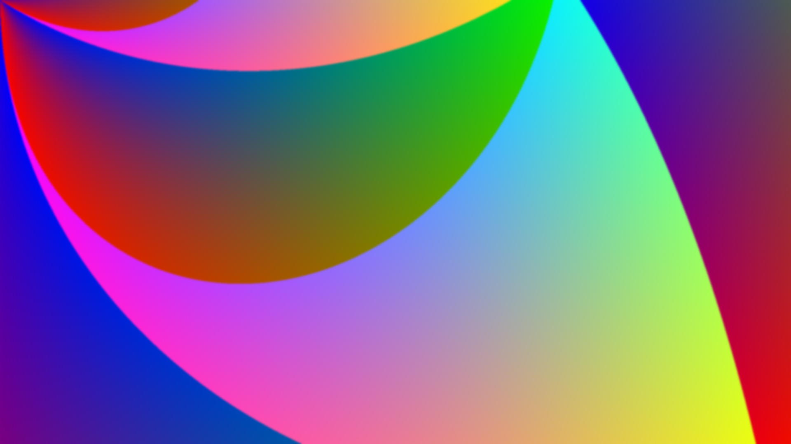

# RGFX

RGFX is a simple Rust library for drawing raster graphics. It isn't efficient
and currently only support writing PPM files (it can write RGB buffers as well,
so hooking into another graphics library should be easy). I mainly use it just
for making cool drawings (see below), and it's really not suited for much else.
If you think this project is cool let me know, and if you have contributions
feel free to make a pull request.

{width=600px}
